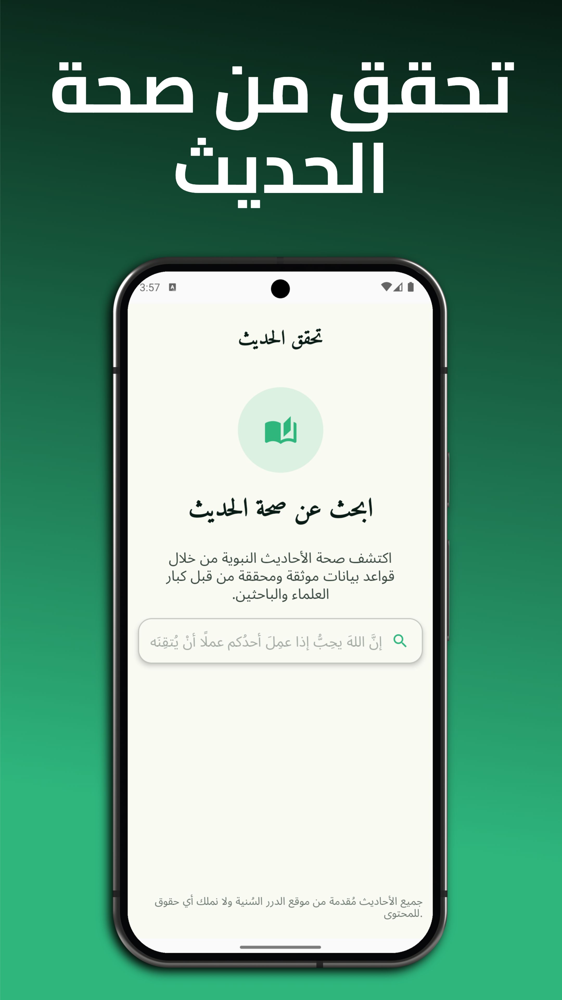
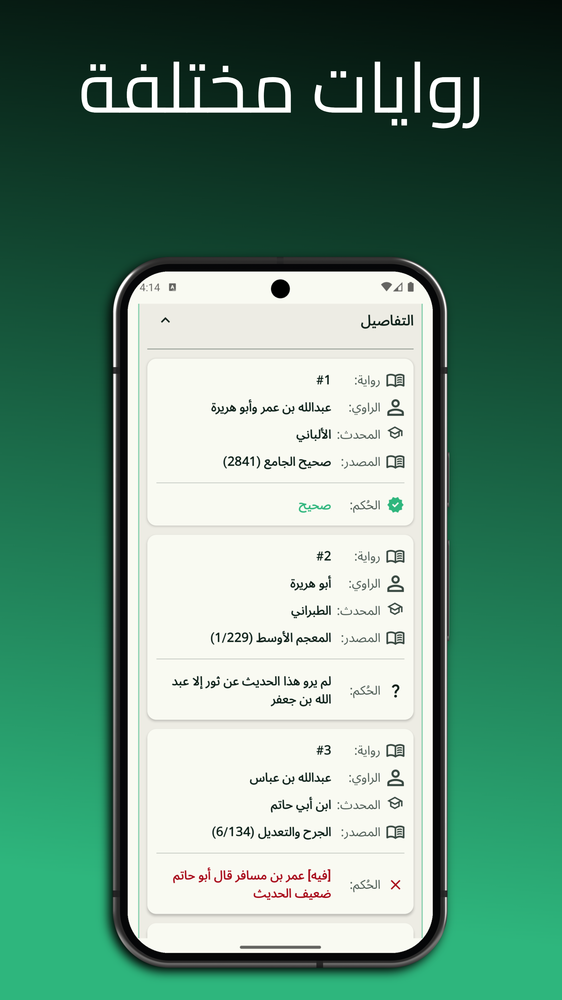
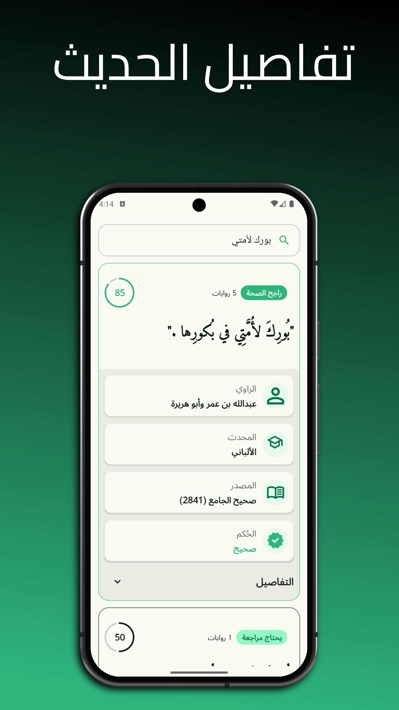
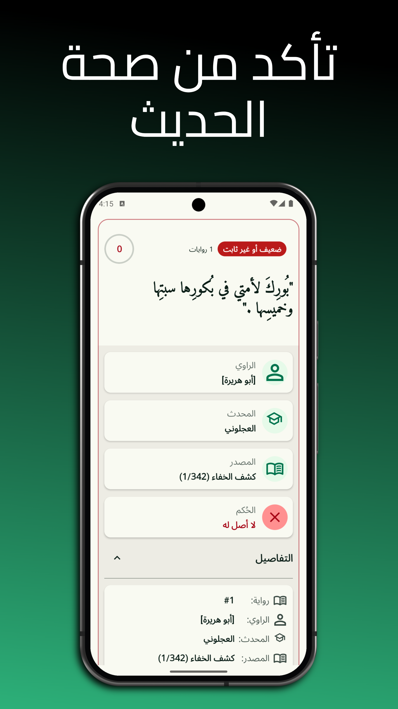
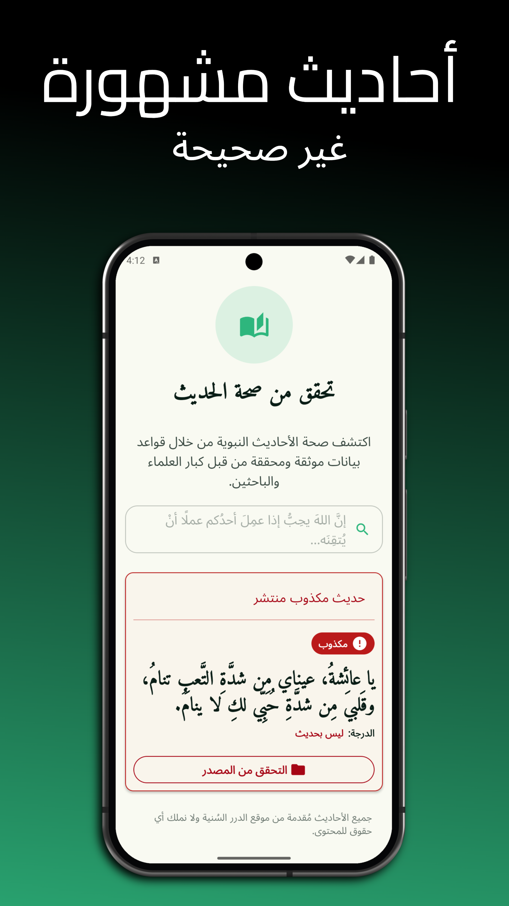

# تحقق - حديث | Tahaqqaq Hadith

  

## Verify the Authenticity of Islamic Hadiths with Confidence

**Tahaqqaq Hadith** is a mobile application dedicated to helping Muslims verify the authenticity of Islamic hadiths. Using comprehensive databases curated by renowned Islamic scholars, the app provides detailed information about hadith validity, grades, and authentic alternative narrations.

---

## ✨ Features

- 🔍 **Advanced Search**: Search through a vast database of hadiths with instant results
- ✅ **Authenticity Verification**: Detailed legitimacy assessment for each hadith with scholarly grades
- 📚 **Comprehensive Database**: Access curated hadiths from authoritative Islamic sources
- 🎯 **Alternative Narrations**: Discover authentic alternatives to fabricated or weak hadiths
- 🌍 **Arabic-First Design**: Optimized user experience for Arabic-speaking users

---

## 📱 Screenshots

  
  
  
  
  

---

## 🚀 Get the App

### Android

### iOS
🔜 **Coming Soon** – iOS app is in development and will be available on the App Store shortly.

---

## 🏗️ Architecture

This project is built with **[Compose Multiplatform](https://www.jetbrains.com/help/kotlin-multiplatform-dev/)** by JetBrains, enabling a single codebase to run on both Android and iOS platforms.

### Technology Stack

- **Kotlin Multiplatform** – Cross-platform development
- **Jetpack Compose** – Modern declarative UI framework
- **Ktor Client** – Network requests and API integration
- **SQLDelight Database** – Local data persistence
- **Koin** – Dependency injection
- **Navigation Compose** – App navigation and routing

---

## 📖 How It Works

1. **Search**: Enter a hadith text or keyword to search the database
2. **View Results**: Browse through verified hadiths with authenticity grades
3. **Check Details**: Read detailed information about the hadith's chain of narration (isnad)
4. **Find Alternatives**: Discover authentic hadith versions if a narration is weak or fabricated
5. **Learn**: Understand Islamic knowledge with scholarly commentary

---

## 🎓 About Hadith Verification

Hadiths are sayings and actions of Prophet Muhammad (peace be upon him) recorded by Islamic scholars. Not all hadiths in circulation are authentic. This app helps you:

- ✅ Distinguish authentic hadiths from weak or fabricated ones
- 📖 Learn from verified Islamic sources
- 🔗 Trace hadith chains back to their origins
- 🌟 Access scholarly grades and assessments

All data is sourced from Dorar's databases and reviewed by qualified Islamic scholars.

## 🤝 Contributing

We welcome contributions! Please feel free to submit issues and pull requests to improve the app's functionality and accuracy.

---

## 📄 License

This project is provided for educational and religious purposes. All Islamic content is used in accordance with Islamic principles.

---

## 🙏 Acknowledgments

- Dorar.net for providing a comprehensive hadith database
- Islamic scholars and muhaddithin for their tireless verification work
- The Kotlin Multiplatform community for excellent tools and documentation
- All contributors and testers who help improve the app

---

## 📧 Contact & Support

For questions, feedback, or support:
- 📧 Email: contact@devlomi.com
- 🐛 Report Issues: [GitHub Issues](https://github.com/devlomi/TahaqqaqHadith/issues)
- 💬 Community: [Community Forum](https://tahaqqaqhadith.com/community)

---

**Made with ❤️ for the Islamic community**

*May Allah accept this effort and make it beneficial for all Muslims.*
